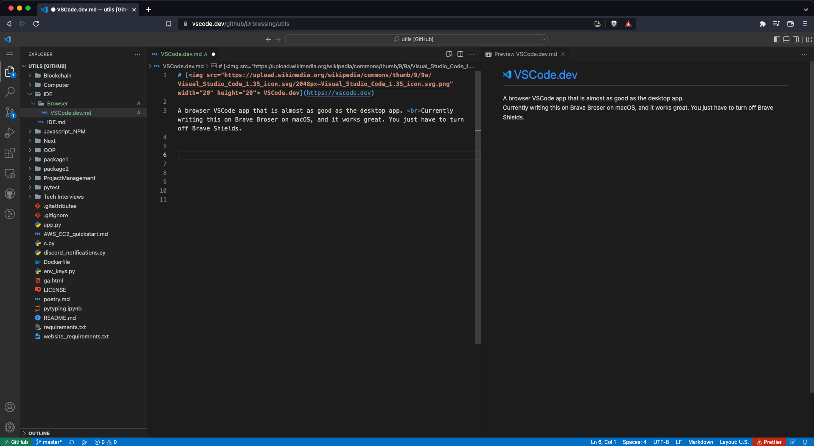

# [ VSCode.dev](https://vscode.dev)

A browser VSCode app that is almost as good as the desktop app. Code from anywhere, anytime! Currently writing this on Brave Broser on macOS, and it works great. You just have to turn off Brave Shields.

Screenshot:
 

Sync with your existing Github VSCode profile to automatically install extensions and themes!

